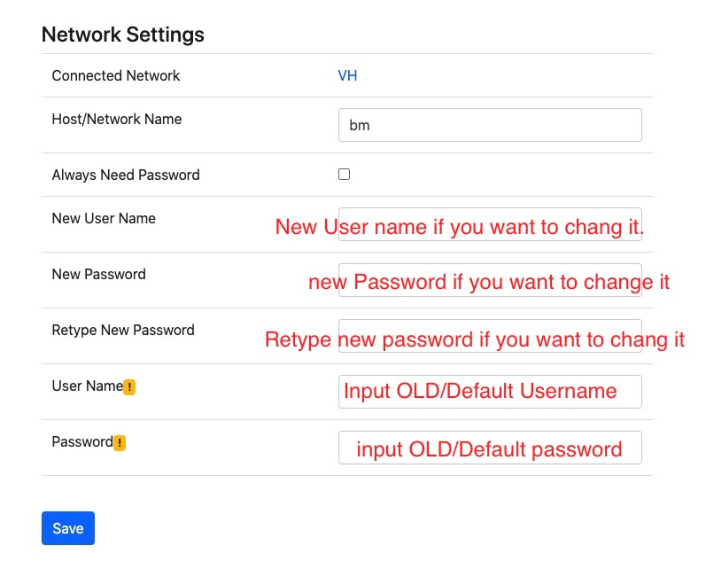
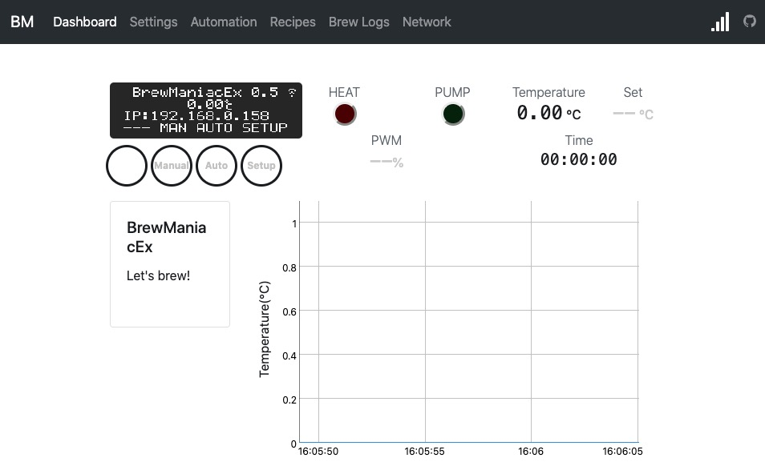
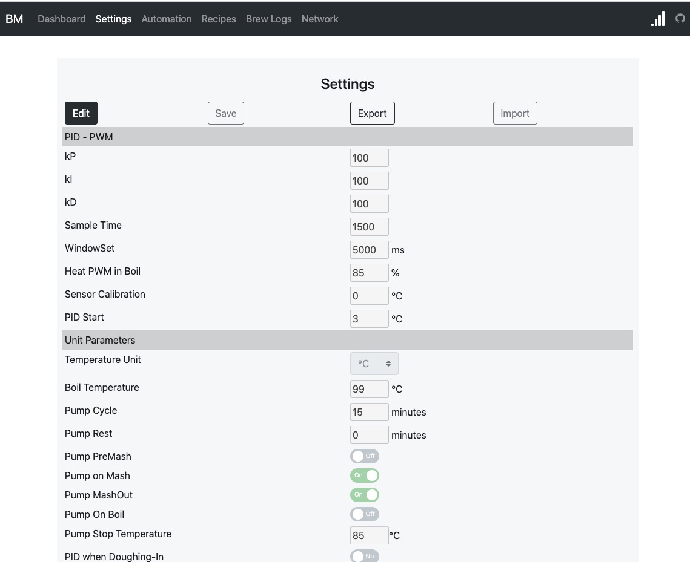
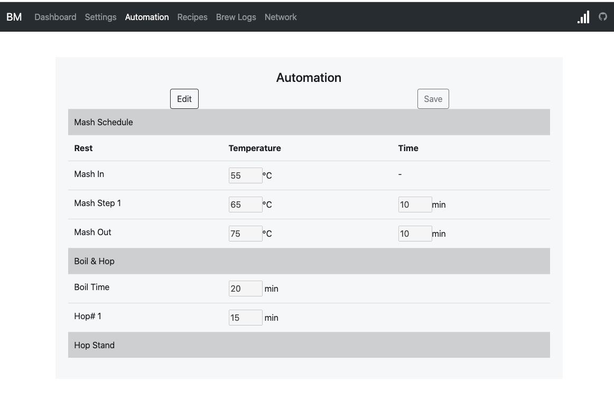
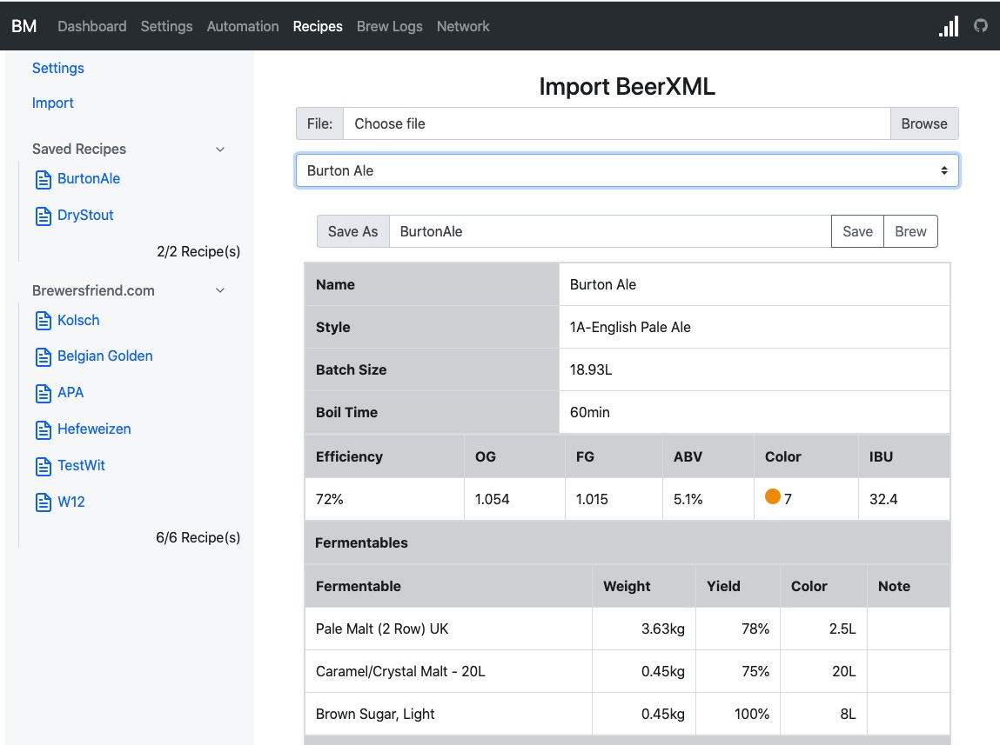
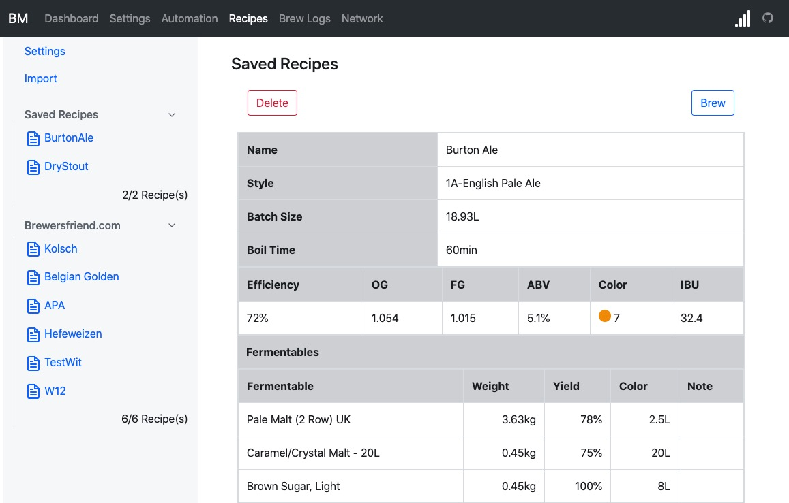
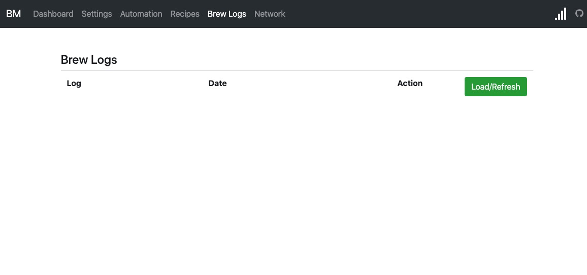

# 5. Web Interface

## 5.0 Initial Setup

Since v0.4.2, BrewManiacEx **_always_** creates a WiFi network and serves as an AP. The SSID is the same as hostname, and **the minimum length of password is 8**. The network BrewManaicEx created is always password protected.

Connect your computer/phone/tablet to the network, "bm" by default, to setup WiFi connection if not yet done.

If the html/javascript files are not uploaded and BrewManiacEx is not connected to a network, a page of network selection will show up. If it doesn’t show up automatically, go to [http://192.168.4.1/](http://192.168.4.1/)

The serving page can be password-protected if "Always need password" option is checked. It is not protected by default. 

The username, password, and hostname can be changed in "Network Settings" page. To change the setting in “Network Settings” page, the correct username and password must be provided. **_The change of network settings will be effective after next power on._**

Default values:	Host Name: bm

UserName: brewmaniac

Password: rdwhahb!  

Password before 0.4.2: bdwhahb

To assin or change WiFi network settings, click the "network name".

## 5.1 Serving page

BrewManiacEx will try to connect to the previously connected network at startup. If the connection is successful, the IP address will be shown. If it can’t connect to the network, it will stay at the "Setup Network.." screen and setup a network named “bm”. Using a computer or phone to connect to that “bm” network, and specify the WiFi network and optional password. If BrewManiacEx connects the network successfully, it will show the IP address on LCD.

The web interface can be accessed by browsers that support HTML5 and WebSocket, like **_Chrome_** and **_Safari_**. 

The hostname which by default is ‘bm’, can be used if mDNS is supported by your phone or computer, which is true for Apple’s products. The serving page can be accessed from

[http://bm.local](http://bm.local)    

or

http://**_[IP_****_ Address]_**

## 5.2 Main/Panel

This tab is used to control and watch the status of BrewManiacEx. The temperature chart is always present after v0.5 even in non brewing mode. Please note that during brewing mode, the data is updated every minutes, and during non brewing mode, the temperature data is updated every 5 seconds. The data in non brewing mode is saved, eithter.

On computers that don't have touched screen, sepcial designed procedure can be used for button combinations, like UP + DOWN to return to main screen.
 * Mouse down *OUTSIDE* the buttons but inside the bounding box of buttons.
 * Move the mouse pointer without releasing over the buttons, like UP and DOWN.
 * Release or Mouse up INSIDE one of the "pressed" buttons

**_NOTE:Controlling the brew remotely might have safety issue._**

## 5.3 Settings

Settings can be exported and then imported. You might want to backup the settings and save it somewhere else.

## 5.4 Automation

## 5.5 Recipes

Recipes are created by importing of BeerXML files. The imported BeerXML should have the following information so that it can be used and translated into automation settings:

* Boil time

* Mash profile

The following fields are also referenced if available

* Hop and other additions schedules

    * The information will be translated into time of "Hop#1", “Hop #2”, etc.

* Water amount of first mash step

    * If the mash-in temperature is set to "calculated", this field is used in the formula to derive mash-in temperature.

Other fields are display only.

### 5.5.1 Recipe Options

* Mash-in temperature will be inserted automatically based on the settings. The formula to calculate mash-in temperature is based on[ Palmer’s formula](http://howtobrew.com/book/section-3/the-methods-of-mashing/calculations-for-boiling-water-additions).

* Temp = R * [Grain weight] / [Water amount] * ( [First rest temp] – [Grain temp] ) + [First rest temp] + [Equipment Adjustment]

* R: is the heat capacity coefficient of grain.

* General speaking, the "Equipment Adjust" should be a minus value because the kettle is at the “mash-in” temperature when doughing in.

* BeerSmith specifies mash-in temperature as INFUSE_TEMP in 1st rest. You can check the optoin to use the mash-in temperature in BeerSmith.

* A mash-out is necessary for BrewManiacEx. If the last mash step in the BeerXML recipe is in the mash-out range( >75°C), it will be regarded as the Mashout step. Otherwise a "Default Mash Out” will be inserted automatically.

* Some XML might not contains temperature ranges for hopstand. **Default HopStand** is used to specify the temperatures.

"Custom Recipe JS" and "custom Recipe Options" provide a way to import cusomtimzed recipe source. Please see the detail in section 5.5.4.

### 5.5.2 Import

Used to import the beer.xml file

* Your BeerXML file may contain more than one recipe, if so you can select your desired recipe.

* You can "Save" or “Brew” your recipe only if it specifies at least the Boil Time and Mash Profile.

* The saved name can’t contain special characters and spaces. The maximum length is 28.

* Caution: Using the same recipe name as an existing saved recipe will overwrite the existing saved recipe.

* You can "Brew" a recipe without having used “Save”. Pressing “Brew” button will set the automation settings.

* The "Mash-In" temperature is derived from the settings at the time it is shown. The “Mash-out” is set to a default if it is not present in the imported BeerXML file. **The original BeerXML is saved**, and you can have different Mash-In and Mash-out(if not present in the BeerXML) if you change the options before “viewing” a recipe

__Known issue: clicking brew button won't bring the page to "Automation".__

### 5.5.3 Saved recipe view

Recipes can be saved to the controllers. Due to the limited memory as well as limited management interfaces, it is not recommended. 

* You can "Delete" and “Brew” the saved recipes.

* You can change the options to get a different Mash-In temperature just before you "Brew" it.

### 5.5.4 Customized Recipe Source

To use Customized Recipe Source, a plug-in, a snipet of Javascript code, is neeed. That js file should locate at somewhere your brower can access. BrewManiacEx will load the plug-in, and use the code of the plug-in to get the list of recipes and recipes.

The option in preference setting will be passed to the plug-in during initialization, so the option is plug-in dependent. To access web service, keys or login credentials are usually necessary. This is the option designed for. Please be careful with the plug-in since your credential data might be passed to the plug-in.

If no custom recipe source plug-in is provided or there are errors during loading of the plug-in, the cusomtized recipe source will not show.

The detail about implementation of customized recipe source plug-in is described in A3.CustomRecipeSource.md.

## 5.6 Brew Logs

## 5.8 Network

## 5.8 Update page

### 5.8.1 Firmware update

**_!!BE CAREFUL!! Uploading the wrong image might brick your controller._**

The firmware can be updated by uploading new *.bin file from browser at this url

http://bm.local:8008/systemupdate

### 5.8.2 Web file update

**_!!BE CAREFUL!! Messing up the files might result in misbehavior of BrewManiacEx._**

To access the SPIFFS file sytem, use the url,

http://bm.local:8008/filemanager

Take care not to mess up the files.

Be Warned! Dangerous!!!

Dangerous!!! Don’t read the following content

*There is a way to format the file system by which all the files and logs will be gone. The url is at http://bm.local/format-spiffs*

Dangerous!!! Don’t read the content brefore
